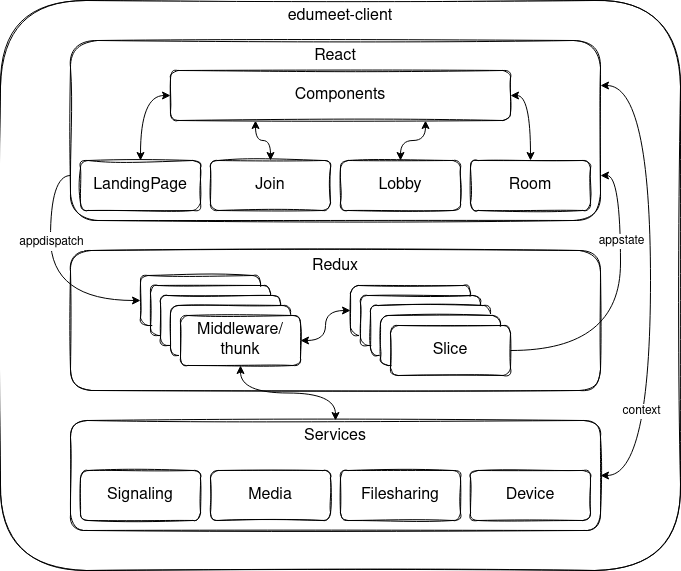

#  Edumeet client

This is the client service for the Edumeet project.




## Usage
### Running the service in development

This will start the service using https with a self-signed certificate. It's exposed on port `4443`.
Https is needed for things such as `navigator.mediaService.getUserMedia()`. 

```bash
$ corepack enable
$ yarn install --immutable
$ yarn start
```

To run the service you need to have Node.js version 24 or higher installed. This project uses Yarn 4 via Corepack.

### Running the service in production

Build the service:
```bash
$ yarn build
```
This will produce a `./build` directory, ready to be deployed. Https is needed for things such as `navigator.mediaService.getUserMedia()`. 

You would in most cases want to replace the `config/` and `images/` directories with your own content.

https://github.com/edumeet/edumeet-docker/tree/4.x has guidelines for running the next generation Edumeet as docker containers.

## Configuration
The app configuration file should be a valid javascript file defining a single
`config` object containing the properties that you need to modify. Below we have configured the ports of our room-server service in development and production. They are used when a participant tries to join a room and a websocket connection to the room-server service is established.

Example `public/config/config.js`:

```javascript
var config = {
  // Room-server websocket ports
  developmentPort: 8443,
  productionPort: 443,

  // Example: keep room id in URL after leaving (4.2+)
  keepRoomNameOnLeave: true,

  // Theme configuration (MUI ThemeOptions + edumeet custom keys)
  // You can override Material UI theme values, e.g. palette.primary.main:
  theme: {
    palette: {
      primary: {
        main: '#313131'
      }
    },

    // Background: either a CSS background value…
    background: 'linear-gradient(135deg, rgba(1,42,74,1) 0%, rgba(1,58,99,1) 50%, rgba(1,73,124,1) 100%)',

    // …or a background image URL (when used by your deployment / UI)
    backgroundImage: 'images/background.jpg',

    // App bar colors (4.2+ adds text/icon colors)
    appBarColor: 'rgba(0, 0, 0, 0.4)',
    appBarTextColor: 'rgba(255, 255, 255, 1.0)',
    appBarIconColor: 'rgba(255, 255, 255, 1.0)',
    appBarFloating: true,

    // Pre-call title colors (4.2+)
    precallTitleColor: 'rgba(255, 255, 255, 1.0)',
    precallTitleTextColor: 'rgba(0, 0, 0, 1.0)',
    precallTitleIconColor: 'rgba(0, 0, 0, 1.0)',

    logo: 'images/logo.edumeet.svg'
  }
};
```
An example configuration file with all properties set to default values
can be found here: [config.example.js](public/config/config.example.js).

### Configuration properties

The client merges your `window.config` with built-in defaults (see `src/utils/types.tsx`).

#### Top-level settings

| Name | Description | Format | Default value |
| :--- | :---------- | :----- | :------------ |
| loginEnabled | If login is enabled. | `boolean` | `false` |
| managementUrl | URL to management service (optional). | `string` | *(unset)* |
| developmentPort | Development room-server websocket port. | `number` | `8443` |
| productionPort | Production room-server websocket port. | `number` | `443` |
| serverHostname | Room-server hostname if different from client host (optional). | `string` | *(unset)* |
| resolution | Default webcam capture resolution. | `low \| medium \| high \| veryhigh \| ultra` | `medium` |
| frameRate | Default webcam capture framerate (fps). | `number` | `30` |
| screenSharingResolution | Default screen sharing resolution. | `low \| medium \| high \| veryhigh \| ultra` | `veryhigh` |
| screenSharingFrameRate | Default screen sharing framerate (fps). | `number` | `5` |
| simulcast | Enable simulcast for webcam video. | `boolean` | `true` |
| simulcastSharing | Enable simulcast for screen sharing video. | `boolean` | `false` |
| autoGainControl | Audio auto gain control. | `boolean` | `true` |
| echoCancellation | Audio echo cancellation. | `boolean` | `true` |
| noiseSuppression | Audio noise suppression. | `boolean` | `true` |
| sampleRate | Audio sample rate (Hz). | `number` | `48000` |
| channelCount | Audio channel count. | `1 \| 2` | `1` |
| sampleSize | Audio sample size (bits). | `8 \| 16 \| 24 \| 32` | `16` |
| opusStereo | Enable OPUS stereo. | `boolean` | `false` |
| opusDtx | Enable OPUS DTX. | `boolean` | `true` |
| opusFec | Enable OPUS FEC. | `boolean` | `true` |
| opusPtime | OPUS packet time (ms). | `number` | `20` |
| opusMaxPlaybackRate | OPUS max playback rate (Hz). | `number` | `48000` |
| audioPreset | Selected audio preset. | `string` | `conference` |
| audioPresets | Available audio presets. | `object` | `{ ... }` |
| buttonControlBar | Show media control buttons in separate control bar. | `boolean` | `true` |
| title | Application title. | `string` | `edumeet` |
| randomizeOnBlank | Randomize room name when blank. | `boolean` | `true` |
| keepRoomNameOnLeave | (4.2+) Keep the room name in the URL when leaving the room. | `boolean` | `true` |
| transcriptionEnabled | Enable transcription. The text comes from the browser's own speech recognition, which sends the speaker's audio to the browser vendor's service (Google for Chrome, Microsoft for Edge). End-to-end encryption does not cover that step; in an end-to-end encrypted room only the transcript sent to the other participants is encrypted. | `boolean` | `true` |
| imprintUrl | Show an imprint link (blank to hide). | `string` | `''` |
| privacyUrl | Show a privacy notice link (blank to hide). | `string` | `''` |
| obfuscateDisplayName | Mask display names in the client monitoring samples sent to the media node (`Jane Doe` becomes `J••• D••`). The UI is unaffected. | `boolean` | `false` |
| knownRegions | Region codes offered in the management UI's tenant editor for the per-tenant "limit media nodes to specific regions" picker. Values must match region labels in the room-server's `countryToRegion` config. Leave empty to hide the limit toggle. | `string[]` | `[]` |
| groupAudioOnly | Initial value of the "Group participants without video" switch (see below). Replaces `showAudioOnly`, which had the opposite meaning. | `boolean` | `true` |
| hideNonVideo | Initial value of the "Hide participants with no video" switch (see below). | `boolean` | `false` |
| hideSelfView | Initial value of the "Hide self view" switch (see below). | `boolean` | `false` |

#### Video tiles and the participants without video

The room shows at most as many tiles as the "Number of visible videos" slider allows (the value the room-server sends is the initial one). Your own tile is one of them. Screen shares, extra videos and the drawing board are shown in their own area and do not count.

The candidates for the remaining tiles are ordered: participants sharing a screen or an extra video first, then participants you pinned in the participant list, then everyone else with the most recent speaker first. A participant who starts speaking while already on screen leaves the layout as it is; only a speaker from outside the visible set takes a tile, from the participant who spoke least recently.

Three appearance switches decide what happens to participants who have no video on screen (camera off, camera not received, or camera left out by the slider):

| Switch | Config key | Behaviour |
| :--- | :--- | :--- |
| Group participants without video (default on) | `groupAudioOnly: true` | Cameras are shown first. One tile is reserved for a box that lists everyone without video and lights up when one of them speaks. |
| Group participants without video off | `groupAudioOnly: false` | Everyone without video gets a tile of their own, counted against the slider like a camera. In a room with more participants than tiles this shows the most recent speakers, whether they have a camera or not; a silent camera can be off screen while a recent speaker without one is on. Turning a camera on or off never moves a tile, it only changes what the tile shows. |
| Hide participants with no video | `hideNonVideo: true` | Nobody without video is shown, not even the speaker, and the group switch is disabled. Your own tile stays. |
| Hide self view | `hideSelfView: true` | Your own tile is removed and its slot goes to another participant. Your own screen share is hidden as well. |

#### Headless view for recorders and streamers

A page opened with `?headless=1` (or `headless=true`) is meant for a headless browser that records, streams or transcribes the room. It joins on its own and shows nothing but the room:

- No join dialog, no lobby dialog, no device preview, so the browser is never asked for a camera or microphone. The microphone and camera stay muted; the bot never sends media.
- The top bar keeps the logo, the meeting timer and the countdown timer. Its buttons and status icons are not shown, the bot icon included; neither are the control bar, the help button, the lobby dialog and the drawing toolbar. Names stay on every tile, the buttons on the tiles do not.
- Pop-up notifications are dropped and notification sounds are off, so they never end up in the capture.
- The layout follows the appearance settings above with this preset, saved like any other change: self view hidden, participants without video ungrouped, nothing hidden, sounds off. Opening a link with `?headless=0` (or `headless=false`) in the same browser puts those four settings back to their defaults.
- Outside the room (connecting, waiting in the lobby, refused, kicked, meeting ended) the page shows only the background and does not reload or rejoin. The status attributes below tell the recorder what happened.
- `?displayName=` names the bot; without one it is called "Bot" rather than taking a name stored in the browser. `?meetingToken=` works as for anyone else.

When client monitoring samples are collected (`clientMonitor.samplingPeriodInMs`), a headless page sends them like any client, marked with `headless: true`, its `botType` and, for a job, its `jobId` in the sample attachments; they describe what the page received, since it sends no media.

The room-server treats a headless peer as a bot rather than a participant: it is not shown in the participant list or counted, it cannot chat, share, draw, raise a hand or vote to end the meeting, it never becomes the first-participant admin of a room, and it does not keep a room open once the last participant has left. Everyone in the room sees a bot icon with the count in the top bar; its tooltip lists the bots' names. It counts the bots in the session the viewer is in, so a participant in a breakout room sees the bots of that breakout room. A moderator can click it to see the list and remove a single bot or all of them, after a confirmation. The browser running the page needs its autoplay policy relaxed, since there is no click-to-play fallback for remote audio.

A bot never opens a room: it is refused (`roomNotOpen`, see the status attributes) until at least one participant is in the room, and the recorder has to try again later.

##### Bot access tokens

In a tenant, whether bots may join is a tenant setting in the management UI ("Who may join as a bot"): disabled (the default), only bots with an access token, or all bots. Tokens are created per tenant in the same place, each with a label and the IP addresses or ranges the bot may connect from; the token is shown once and only its hash is stored. A bot presents its token in the URL fragment, which browsers never send to any server, and the client passes it to the room-server in the socket handshake body, so it appears in no access log:

```
https://rooms.example.edu/<room>?headless=1&botType=recorder&displayName=Recorder#botToken=<token>
```

A bot records one session. Without `session` it is in the main room; with `?session=<breakout session id>` the room-server places it in that breakout room at join (the id is the `roomSessionId` the client receives with each breakout room). The breakout room may still be empty. A bot is refused with `sessionNotOpen` when no such breakout room exists, and it is ended with `sessionClosed` when the breakout room is removed or ejected, rather than following the participants back to the main room. Run one page per session to record the main room and breakout rooms at the same time. The bot icon in the top bar counts the bots in the session the viewer is in.

A bot with a valid token from an allowed address is verified: it skips the lobby of a locked room and needs no meeting token in a meetings-only room. A bot with a token that does not verify is refused rather than admitted as a plain bot. `botType` (`recorder`, `transcriber` or `streamer`) is passed on to the other participants for information. Outside a tenant (a deployment without a management server) bots need no token.

##### Starting a recording, a stream or a transcription from the room

When a tenant has configured a **bot provider** for a kind of job (an outside service that records,
streams or transcribes, see
[BOT-PROVIDER-API.md](https://github.com/edumeet/edumeet/blob/main/BOT-PROVIDER-API.md)), moderators
get an entry per kind in the More menu: "Start server recording", "Start live stream", "Start server
transcription". They appear only for a kind the tenant has a provider for, and only for moderators;
a tenant without providers sees nothing new anywhere. Where login is enabled, a moderator who is not signed in sees the entry
disabled with "Log in to record" (a deployment without login has no such entries): the recording, stream link or transcript is sent by email to the owners of the room and to
the moderator who started it, resolved from their accounts, so somebody signed in has to start it.
The confirmation says so. Stopping a job needs the same; a moderator who is not signed in can still remove
the bot from the bot menu, which ends its job.

Starting one is confirmed in a dialog that names the provider, and in an end-to-end encrypted room
says that the provider will be able to see and hear the meeting. Where a tenant has more than one
provider of the same kind, the dialog also asks which one.

While a job captures, everyone in the room sees it in the top bar: a blinking red dot for a
recording, and the icon of the kind for a live stream or a transcription, one icon per kind however
many jobs of it run. The icon dims while the job's browser is away and expected back. The bot icon
next to it opens, for a moderator, a row per job with the provider's name, what the job is doing and
a **Stop** button; stopping asks the provider to finish properly rather than cutting the browser off.
Bots that belong to no job are removed with **Kick** as before, as is a job whose browser does not
leave. A job that fails tells the moderators, by the provider's name and reason.

A transcriber page (`botType=transcriber`) declares no video capability, so it receives audio only
and no video is decoded or decrypted on it.

A room with a bot in it stays on the media node: a meeting small enough for peer-to-peer media
goes through the media node while a bot is there, so what the bot receives does not change when
the next participant arrives.

A page that belongs to a job carries `jobId` in its URL and gets one extra function,
`window.edumeetBot.status(state, reason)`, for the recorder to report `running`, `finished` or
`failed` with. Such a page also waits: refused with `roomNotOpen` it tries again quietly every 3
seconds for 30 seconds, writing nothing to the status attributes until it gives up, because after a
room-server restart the recorder may be back before the first participant is.

#### Status attributes on the document

Every client writes three attributes on the `<html>` element for debugging and for recorders. They only ever hold codes from the lists below, never names, ids or tokens.

| Attribute | Values |
| :--- | :--- |
| `data-edumeet-state` | `new`, `lobby`, `joined`, `left`, `mgmt-admin` |
| `data-edumeet-connection` | `new`, `connecting`, `connected`, `reconnecting`, `disconnected` |
| `data-edumeet-reason` | absent until the client stops, then the first of: `meetingTokenRequired`, `meetingTokenInvalid`, `e2eeUnsupported`, `e2eeFailed`, `kicked`, `meetingEnded`, `connectionClosed`, `joinErrorPending` (a headless page did not auto-join because an earlier join error is still stored), `roomNotOpen` (a bot arrived before any participant), `botsNotAllowed` (the tenant admits no bots, or none without a token), `botTokenRejected` (the token, its state or the bot's address did not pass; the room-server log has the detail), `sessionNotOpen` (a bot named a breakout session that does not exist), `sessionClosed` (the breakout session a bot was recording was closed), `left` (the user left) |

#### Theme settings (`config.theme`) (4.2+)

Theme/UI parameters live under `config.theme` (they were previously shown mixed into the main table).

| Name | Description | Format | Default value |
| :--- | :---------- | :----- | :------------ |
| theme.background | Page background (CSS value). | `string` | `linear-gradient(...)` |
| theme.appBarColor | App bar background color. | `string` | `rgba(0, 0, 0, 0.4)` |
| theme.appBarTextColor | App bar text color. | `string` | `rgba(255, 255, 255, 1.0)` |
| theme.appBarIconColor | App bar icon color. | `string` | `rgba(255, 255, 255, 1.0)` |
| theme.appBarFloating | Float app bar over content. | `boolean` | `true` |
| theme.precallTitleColor | Pre-call title background color. | `string` | `rgba(255, 255, 255, 1.0)` |
| theme.precallTitleTextColor | Pre-call title text color. | `string` | `rgba(0, 0, 0, 1.0)` |
| theme.precallTitleIconColor | Pre-call title icon color. | `string` | `rgba(0, 0, 0, 1.0)` |
| theme.logo | Logo URL. | `string` | `images/logo.edumeet.svg` |
| theme.activeSpeakerBorder | Active speaker border CSS. | `string` | `1px solid rgba(255, 255, 255, 1.0)` |
| theme.videoBackroundColor | Video tile background color. | `string` | `rgba(49, 49, 49, 0.9)` |
| theme.videoAvatarImage | Fallback avatar image URL. | `string` | `images/buddy.svg` |
| theme.roundedness | UI border radius. | `number` | `10` |
| theme.sideContentItemColor | Side panel item color. | `string` | `rgba(255, 255, 255, 0.4)` |
| theme.sideContentItemDarkColor | Side panel item color (dark). | `string` | `rgba(150, 150, 150, 0.4)` |
| theme.sideContainerBackgroundColor | Side panel background color. | `string` | `rgba(255, 255, 255, 0.7)` |

---
#### Audio preset fields (`config.audioPresets.<preset>`)

Each entry inside `audioPresets` defines the WebRTC audio constraints and OPUS encoder settings
used when the preset is selected via `audioPreset`.

| Name | Description | Format | Default |
| :--- | :--- | :--- | :--- |
| autoGainControl | Enable audio auto gain control. | `boolean` | `true` |
| channelCount | Audio channel count. | `number` | `1` |
| echoCancellation | Enable echo cancellation. | `boolean` | `true` |
| noiseSuppression | Enable noise suppression. | `boolean` | `true` |
| sampleRate | Audio sample rate (Hz). | `number` | `48000` |
| sampleSize | Audio sample size (bits). | `number` | `16` |
| opusStereo | Enable OPUS stereo. | `boolean` | `false` |
| opusDtx | Enable OPUS DTX. | `boolean` | `false` |
| opusFec | Enable OPUS FEC. | `boolean` | `true` |
| opusPtime | OPUS packet time (ms). | `number` | `20` |
| opusMaxPlaybackRate | OPUS maximum playback rate (Hz). | `number` | `48000` |

Example:

```js
audioPresets: {
  conference: {
    autoGainControl: true,
    echoCancellation: true,
    noiseSuppression: true,
    sampleRate: 48000,
    channelCount: 1,
    opusFec: true,
    opusDtx: false,
    opusStereo: false,
    opusPtime: 20
  }
}
```
